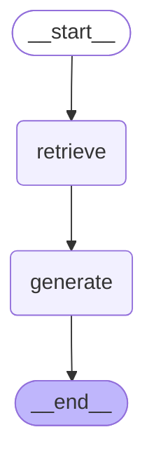

# 10. LangGraph 구조 (`python scripts/show_graph.py` 출력)

```mermaid
graph TD;
	__start__([<p>__start__</p>]):::first
	retrieve(retrieve)
	generate(generate)
	__end__([<p>__end__</p>]):::last
	__start__ --> retrieve;
	retrieve --> generate;
	generate --> __end__;
	classDef default fill:#f2f0ff,line-height:1.2
	classDef first fill-opacity:0
	classDef last fill:#bfb6fc

```
